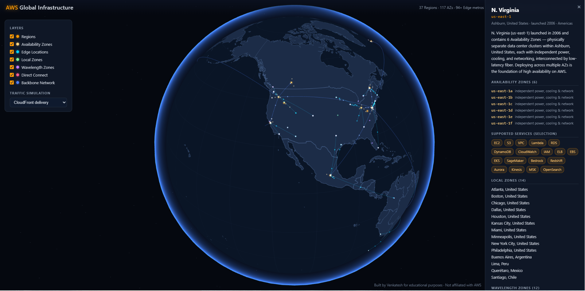

# 🌍 AWS Global Infrastructure – Interactive 3D Explorer

> An interactive visual guide to explore the AWS Global Infrastructure in a simple and engaging way.

## 🚀 Live Demo

**https://venkateshk111.github.io/aws-global-infrastructure/**

---

## 🖼️ Preview

---

## 📖 About

AWS Global Infrastructure can be difficult to understand through documentation alone. This project provides an **interactive 3D visualization** that helps learners explore how AWS builds its global cloud platform.

The application is designed for:

* Students learning AWS
* AWS Certification preparation
* Cloud Engineers
* Solution Architects
* Trainers and Instructors
* Anyone curious about AWS Global Infrastructure

---

## 🌎 Explore

The interactive experience includes:

* 🌍 AWS Regions
* 🏢 Availability Zones (AZs)
* 📍 Local Zones
* ⚡ Wavelength Zones
* 🌐 Edge Locations
* 📦 Regional Services
* 🔗 AWS Global Network
* 🛰️ Global Infrastructure Connectivity

---

## ✨ Features

* Interactive 3D Earth
* Modern responsive interface
* Educational visualizations
* AWS-inspired design
* Fast loading
* Desktop and mobile friendly
* No installation required

---

## 🎯 Purpose

This project was created to make learning AWS Global Infrastructure more intuitive through visualization rather than static diagrams.

It is intended to complement the official AWS documentation and provide an easier way to understand concepts such as Regions, Availability Zones, Local Zones, Edge Locations, and the AWS global network.

---

## 🗂️ Version History

### v1.1 — Learning & Usability Enhancements
* Added AZ-count badges on each Region marker on the globe, tied to the Availability Zones layer toggle
* Added a "Nearest Edge Locations" section to the Region side panel, computed by geographic distance
* Added inline ⓘ info icons with plain-language definitions for every panel section, including Regions
* Added a collapsible Glossary section (below the Layers card) covering Region, AZ, Local Zone, Wavelength Zone, Edge Location, Direct Connect, and Backbone Network
* Added a Dark/Light theme toggle, with adjusted marker/line rendering so glowing elements stay visible in both modes

### v1.0 — Initial Release
* Interactive 3D globe with AWS Regions, Availability Zones, Edge Locations, Local Zones, Wavelength Zones, and Direct Connect locations
* Animated AWS backbone network connections with traffic flow effects
* Hover tooltips and clickable Region side panels with detailed information
* Layer toggle controls and traffic simulation modes (CloudFront delivery, S3 Cross-Region Replication, and more)
* AWS-inspired dark theme, deployed via GitHub Pages

---

## 📚 Learn More

Official AWS documentation:

https://aws.amazon.com/about-aws/global-infrastructure/

---

## 👨‍💻 Author

**Venkatesh K**

* AWS Community Builder
* AWS 4x Certified

LinkedIn: [linkedin.com/in/venkatesh111/](https://www.linkedin.com/in/venkatesh111/)

---

## ⭐ Support

If you found this project helpful, please consider giving it a **⭐ Star** on GitHub. It helps others discover the project and motivates future improvements.

---

## ⚠️ Disclaimer

This project is an independent educational initiative created by **Venkatesh K**.

It is **not affiliated with, endorsed by, sponsored by, or maintained by Amazon Web Services (AWS) or Amazon.com, Inc.**

AWS and related trademarks are the property of Amazon.com, Inc. or its affiliates.

## License

MIT — see [LICENSE](LICENSE) for details.
